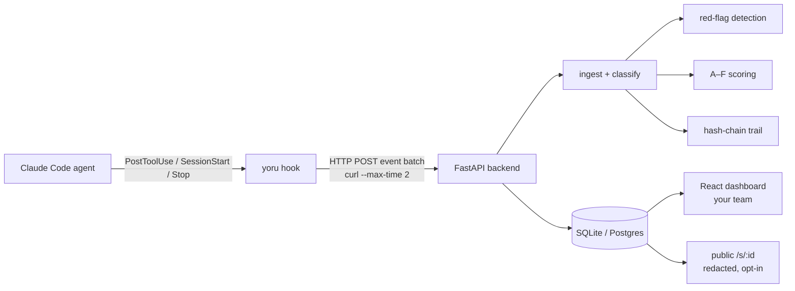
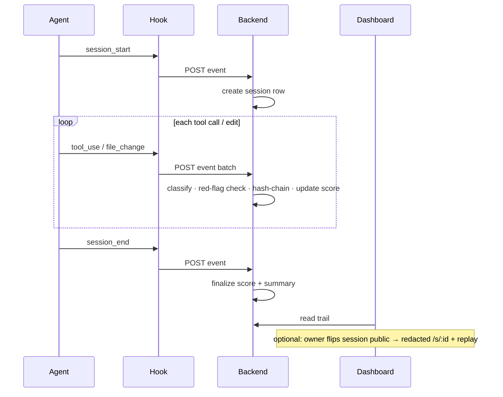

# Yoru

Audit trail for autonomous AI coding agents. Install a Claude Code hook and every tool call, file edit, prompt, and response your overnight agent runs streams to a dashboard you control — with red-flag detection and a per-session letter grade on Throughput, Reliability, and Safety.

> **Yoru is self-hosted.** You run the backend + dashboard on your own box; your session data never leaves your network. This repo is the AGPL-licensed server. There is no hosted Yoru.

## Why

An autonomous agent working unattended can run hundreds of tool calls in one session — shell commands, file edits, migrations, `git` operations. When you come back in the morning, the chat scrollback tells you what it *said*, not what it *did*. Yoru records what it did: an append-only, hash-chained trail of every action, with the risky ones (secrets, destructive shell, schema changes) flagged at the moment they land.

You get the trail whether the session went well or off the rails — and you can hand someone a link to a single session instead of a screenshot.

## How it works

A small hook installed in Claude Code POSTs each event to your backend. The backend classifies it, runs red-flag detection, folds it into a running per-session score, and chains it into a tamper-evident log. The dashboard reads from your database; a session you choose to share renders as a redacted public page.



The hook calls `curl --max-time 2 || true`, so a slow or down Yoru never stalls the agent's terminal — a dropped event is preferred over a blocked session.

## Self-host, quick path

No external services required. Auth and data both run inside the stack by
default — SQLite on disk, password auth in-process. **No Supabase account, no
cloud database, no SMTP needed to get running.**

```bash
git clone https://github.com/TsukumoHQ/yoru.git && cd yoru
cp .env.example backend/.env            # root .env.example = self-host defaults, work as-is
make dev                                # api :8002 + dashboard :5173
```

Open the dashboard — on a fresh instance you land on a **first-run wizard** that
creates your admin account (and lets you point at an existing database if you
want one). Prefer the terminal? Run it headless:

```bash
make setup            # interactive: pick a DB, create the admin
```

Then point the CLI at your instance:

```bash
pip install yoru-cli
yoru init --server https://yoru.acme.com
```

`--server` is required — there is no default. `yoru init` installs the hook into
`~/.claude/hooks/`, registers it in `~/.claude/settings.json`, and pairs the
machine with a device code. Run `yoru doctor` if anything looks off.

## Core concepts

### The session trail

Each session is an ordered list of events. The hook emits five kinds, and the
backend infers the kind from the tool name when the hook doesn't set it:

| Kind | What it is |
|---|---|
| `session_start` | a session began (sets `started_at`) |
| `tool_use` | a tool ran — `Bash`, `Grep`, an MCP call |
| `file_change` | a file was written — `Write`, `Edit`, `MultiEdit`, `NotebookEdit` |
| `message` | a user prompt or assistant response |
| `session_end` | the session stopped (sets `ended_at`, triggers summary) |

The trail is append-only. Backfill from a transcript can push `started_at`
earlier, but events are never mutated in place.

### Red-flag detection

Six kinds of risky action are detected by pattern at ingest — no model call, no
network — and pinned to the event that triggered them:

| Flag | Triggers on |
|---|---|
| `secret` | AWS / Stripe / JWT / SSH key patterns in content |
| `env` | writes to `.env*` (except `.env.example`) |
| `shell` | `rm`, `dd`, `mkfs` |
| `db` | `DROP`, `TRUNCATE`, unscoped `DELETE` / `UPDATE` |
| `migration` | edits under `migrations/`, `prisma/`, `alembic/` |
| `ci` | edits to `.github/workflows/`, `vercel.json`, `Dockerfile` |

These are heuristics — they catch the common shapes, not every possible one.
They exist to surface *"look at this one"*, not to prove safety.

### Session scoring

Every session gets a letter grade A–F composed from three axes:

- **Throughput** — how much useful work landed.
- **Reliability** — error and retry rate.
- **Safety** — red-flag density.

The grade is a heuristic summary for scanning a fleet at a glance, not a
certification.

### Tamper-evident trail

Each event stores `entry_hash` = hash of its content plus the previous event's
`prev_hash`, forming a chain. `GET /sessions/{id}/verify` re-walks the chain and
reports the first break. This makes after-the-fact edits **detectable** — it is
tamper-*evident*, not cryptographically signed; there is no private-key
signature, so treat it as an integrity check, not non-repudiation.

### Shareable receipts

Flip a session public and it gets a `yoru.sh/s/<id>` page. Sharing is **opt-in
and off by default** — and before anything is exposed, a redaction pass runs
over titles, content, tool inputs, and paths:

- secret patterns → `[redacted:kind]`
- home directories (`/Users/you`, `/home/you`, `C:\Users\you`) → `~`
- git remotes → `[redacted:repo]`

The public endpoint never returns `user`, `cwd`, `git_remote`, or
`workspace_id`. A private or unknown id returns 404 — never a partial leak.

### Session replay

The public page can replay a session step by step: a scrubber that skips idle
gaps, red-flag markers on the timeline, keyboard navigation, play/pause
autoplay, and `?t=<step>` deep-links to a specific moment.

### Token & cost recap

Each session totals input/output tokens and an **API-equivalent cost** — what
those tokens would cost at list API prices. It is a reference figure for
comparing sessions, not a bill or a measure of what you actually paid.

### A session, end to end



## Choose your stack

Everything below is optional — the defaults are fully local.

| Concern | Default (zero-config) | Bring your own |
|---|---|---|
| **Auth** | `AUTH_PROVIDER=local` — users in your DB, scrypt + JWT | `AUTH_PROVIDER=supabase` — hosted/self-hosted GoTrue (set `SUPABASE_*`) |
| **Database** | bundled SQLite at `backend/data/receipt.db` | any Postgres — set `RECEIPT_DB_URL=postgres://…` (or paste it in the wizard) |
| **Email** | none — welcome mail skipped | SMTP via `EMAIL_PROVIDER=smtp` + `SMTP_*` |

The **first registered user becomes the admin.** For an internet-exposed
instance, set `SETUP_TOKEN=<random>` so only someone holding the token can run
the wizard. Pin `AUTH_JWT_SECRET` in production (the wizard does this for you).

Full walkthrough — Postgres, GitHub OAuth, SMTP, and the Supabase path — in
[`docs/SELF-HOST.md`](docs/SELF-HOST.md).

## Layout

| Directory | What it is |
|---|---|
| `backend/` | FastAPI service — event ingest, red-flag detection, session scoring; pluggable auth (local or Supabase) and database (SQLite or Postgres) |
| `frontend/` | React dashboard (the app a self-hoster exposes to their team) |
| `packages/receipt-ui/` | Shared component library consumed by `frontend/` |
| `docs/` | Self-host guide, architecture, hook contract |

The CLI lives in a separate MIT repo: [github.com/TsukumoHQ/cli-yoru](https://github.com/TsukumoHQ/cli-yoru) · `pip install yoru-cli`.

> Naming note: the CLI is `yoru-cli`, but some internals are still half-migrated from the project's old name (`receipt`) — `RECEIPT_*` env vars, the `rcpt_` token prefix, `receipt.db`, `packages/receipt-ui`. These are load-bearing; don't rename them casually.

## Dev setup (contributors)

```bash
make install             # uv sync (Python) + npm ci (JS)
make restart-backend     # uvicorn on :8002, idempotent
curl http://localhost:8002/health/ready
make test-backend        # pytest gate
```

See [`docs/ARCHITECTURE.md`](docs/ARCHITECTURE.md) for the stack layout and boundaries.

## Status

**v0.1.0 (beta).** Self-hosted-only. The core flow — install hook → ingest →
dashboard → red-flags → score → share/replay — runs end to end on SQLite + local
auth with zero external services. Billing is gated off by default. See
[releases](https://github.com/TsukumoHQ/yoru/releases).

## License

AGPL-3.0 · [LICENSE](./LICENSE). Modifying the server and exposing it to other users triggers the source-distribution clause — fine for internal company self-hosting, talk to us first before running a competing hosted service on top of this code.

The CLI is MIT (separate repo). See [`LICENSING.md`](./LICENSING.md) for the full rationale.

Issues and PRs welcome.
